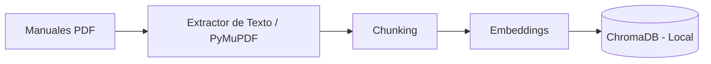
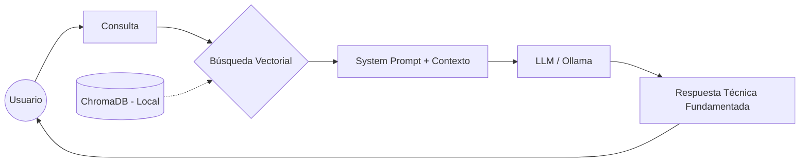

# Sistema RAG HRRG

## Integrantes del equipo

- Ana María Ramos Orcko
- Marisa Velasquez  
- Nancy Julieta Cassano
- Darío García Barquet  
---

## Descripción del proyecto  
  
Este proyecto tiene como objetivo el desarrollo de un asistente de inteligencia artificial especializado para el área de Ingeniería Clínica del Hospital Regional Río Grande. Su propósito es optimizar la gestión del ciclo de vida de los equipos médicos, proporcionando una herramienta digital integral que brinde trazabilidad y eficiencia a los técnicos de mantenimiento y operarios de la maquinaria.  
  

---

## Objetivos del proyecto

- ***Objetivo general:***  
Desarrollar un prototipo funcional de un Asistente de Inteligencia Artificial especializado para el área de Ingenieria Clínica del Hospital Regional Río Grande, basado en una arquitectura de Generación Aumentada por Recuperación (RAG), con el fin de optimizar la gestión del ciclo de vida de los equipos médicos y mejorar la toma de decisiones técnicas mediante el acceso eficiente y trazable a manuales oficiales. 

- ***Objetivos específicos:***  
    - **Procesamiento de la Información:** Implementar un flujo de injesta de datos que permita la extracción de texto, fragmentación y conversión de vectores de los manuales de servicio en formato PDF.
    - **Implementación de Almacenamiento:** Configurar una base de datos vectorial local para la persistencia de la información y la portabilidad del sistema.
    - **Integración de un Modelo de Lenguaje:** Desarrollar un motor de inferencia local para la ejecución de modelos de lenguaje.
    - **Creación de la Interfaz de Usuario:** Construir una aplicación web modular simple que permita a los técnicos realizar consultas en lenguaje natural.

---

## Herramientas utilizadas

- **Backend:** Python / Flask / PyMuPDF o PyPDF2
- **IA:** Ollama (Llama 3)
- **Base de Datos Vectorial:** Chroma DB  

---

## Arquitectura del Sistema

El asistente utiliza una arquitectura de Generación Aumentada por Recuperación (RAG). Este enfoque permite que el modelo de lenguaje responda consultas basándose exclusivamente en una base de conocimientos externa y técnica, evitando alucinaciones y garantizando la trazabilidad de la información provista.  
La arquitectura se divide en dos procesos principales:

**1. Proceso de Ingesta:**
En esta etapa se prepara todo el conocimiento que el asistente utilizará más adelante. Se compone de los siguientes subprocesos:
- *Carga de Documentos*: Se cargan los manuales técnicos oficiales de parte de los fabricantes, principalmente en formato PDF.
- *Extracción*: Se utiliza un módulo de extracción como PyMuPDF o PyPDF2 para convertir el PDF en texto plano procesable.
- *Fragmentación o Chunking*: El texto se divide en fragmentos para que la búsqueda sea precisa y no exceda la ventana del contexto.
- *Vectorización e Indexación*: Cada fragmento se convierte en un vector numérico (*embedding*) y e almacena en ChromaDB.

**2. Proceso de Inferencia:**
Esta etapa abarca los subprocesos que ocurren cuando un técnico interactúa con el LLM:
- *Consulta*: El usuario envía una pregunta o busca información sobre un equipo en lenguaje natural.
- *Búsqueda*: El sistema busca en ChromaDB los fragmentos de texto cuyos vectores sean más similares a los de la consulta.
- *Creación del Contexto*: En conjunto con un prompt del sistema, se combina la consulta del usuario con los datos técnicos encontrados en la base de datos a partir de la búsqueda de vectores.
- *Generación de Respuesta*: El LLM ejecutado localmente por Ollama procesa el prompt y genera una respuesta fundamentada únicamente por el contexto proporcionado, evitando alucinaciones.

---

## Fuente de datos

La fuente de los datos serán documentos de los equipos de las áreas cubiertas por el alcance del proyecto, provistos por los fabricantes de cada uno. Principalmente en formato PDF, fragmentados (_chunking_) y  convertidos en vectores, los cuales el LLM los usará como contexto.

## Seguridad y Ética
Como el asistente opera en un ámbito crítico, el desarrollo se rige por los siguientes pilares de seguridad y ética:

**1. Privacidad de los Datos**
- A diferencia de soluciones basadas en la nube, el equipo de desarrollo optó por herramientas como Ollama y ChromaDB de forma local. Esto garantiza que la información técnica y cualquier dato sensible del Hospital Regional Río Grande permanezca dentro de la infraestructura del Ministerio de Salud, cumpliendo con las normas de protección y confidencialidad de los datos.

**2. Eliminación de Alucinaciones**
- El sistema está restringido a responder únicamente basado en los manuales proporcionados. El modelo está instruido para declarar que no posee la información en el caso de que la misma no se encuentre en la base de datos vectorial, en lugar de generar una respuesta "creativa" o errónea.

**3. Responsabilidad y Uso Ético**
- El asistente se define y aclara explicitamente en su interfaz que es una herramienta de apoyo a la toma de decisiones técnica y capacitada. No reemplaza el juicio profesional.

---

## Contacto

Nancy Julieta Cassano: doctoracassano@gmail.com  
Darío Agustín García Barquet: barquetdarioo@gmail.com  
Marisa Mercedes Velasquez: marisav3009@gmail.com  
Ana María Ramos Orcko: iacienciadedatos@gmail.com  
